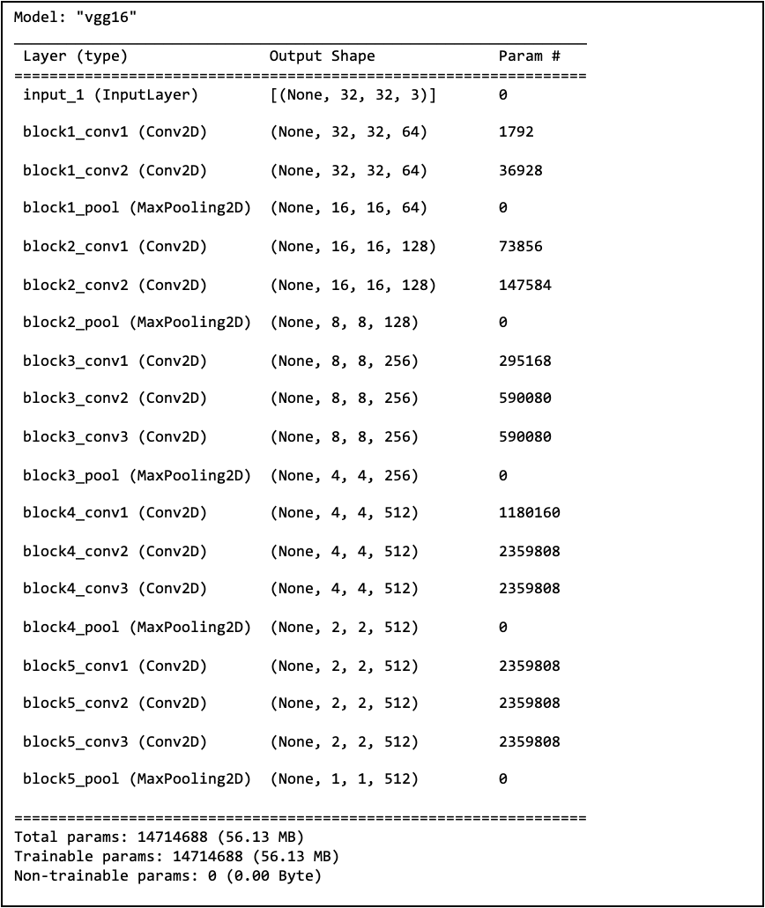
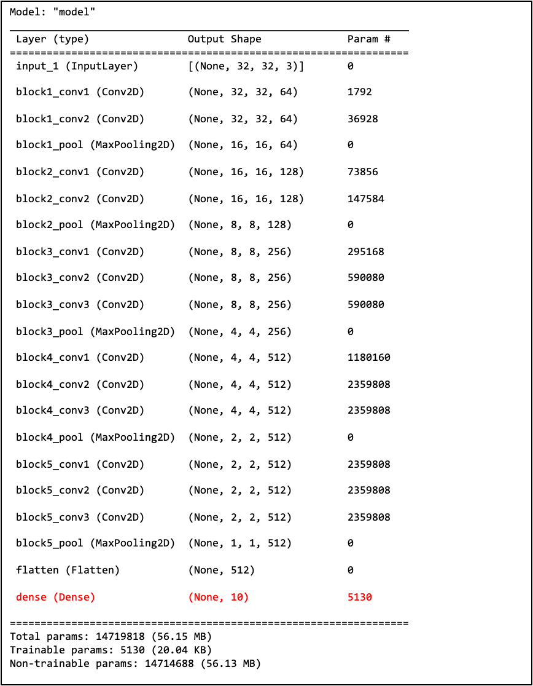

# Transfer learning for CIFAR10
This project demonstrates transfer learning using the VGG16 model pre-trained on ImageNet, adapted for the CIFAR10 classification task. By replacing the final layer and fine-tuning the model with different amounts of training data, we explore how the size of the training dataset affects model performance. The experiment provides insights into the trade-offs between training data size, model accuracy, and potential overfitting issues when applying transfer learning to a new domain.


## Architecture of the pre-trained VGG16 model using built-in functions in Python
<p align="center">

</p>
 
## Replacing the last layer in VGG16 to make it classify 10 classes
New architecture after replacing the last layer:
<p align="center">

</p>
 
## Project Structure
```
project/
├── requirements.txt
└── src/
    ├── __init__.py
    ├── config.py
    ├── model.py
    ├── train.py
    └── main.py
```

## Finetuning the model with 100, 1k, 10k, and 50k images in the training dataset of CIFAR10
| Training size | Training accuracy | Testing accuracy |
|--------------|------------------|------------------|
| 100          | 0.170            | 0.117            |
| 1,000        | 0.504            | 0.324            |
| 10,000       | 0.607            | 0.499            |
| 50,000       | 0.547            | 0.517            |

Finetuning with larger training sizes generally improves accuracy, but the gap between training and testing accuracy raises concerns about overfitting. Additionally, the accuracy of the model is significantly low, considering the training size, which suggests that this task is too complex or the model is not a good fit for it.
